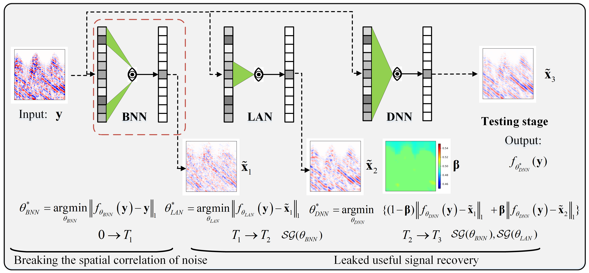
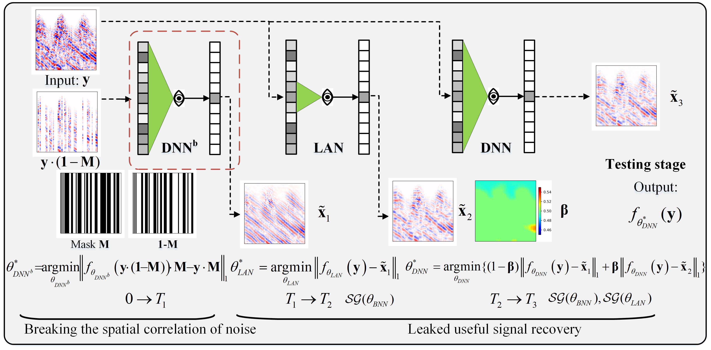
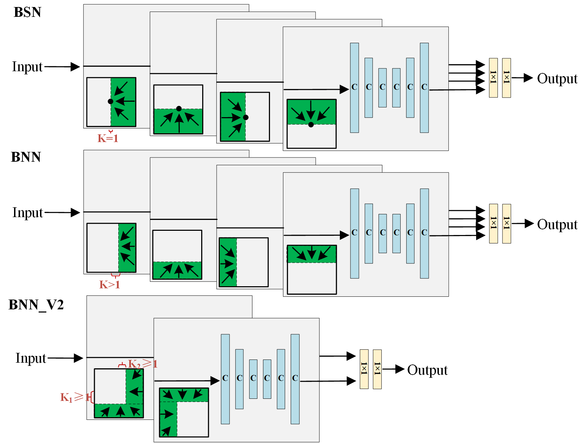
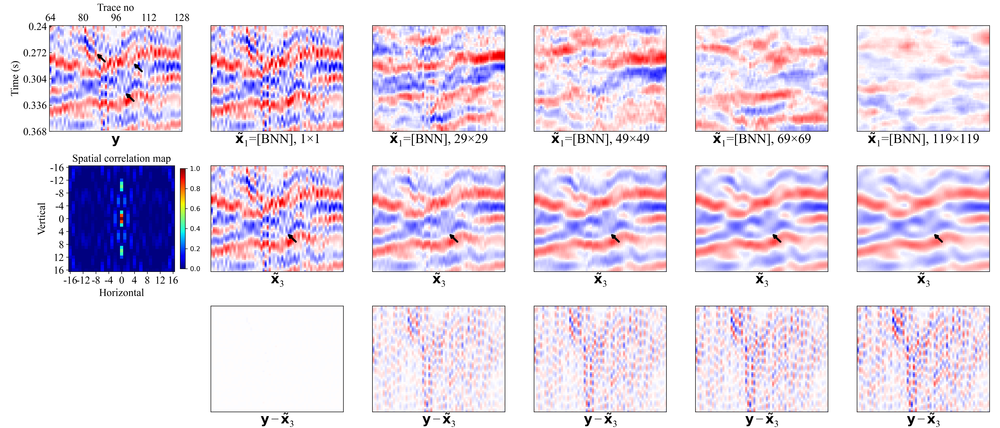

# 2025 TGRS A Self-Supervised Method for Seismic Random Noise Attenuation under Non-Pixelwise Independent Assumption~~
 This repo contains the official implementation for the paper [A Self-Supervised Method for Seismic Random Noise Attenuation under Non-Pixelwise Independent Assumption](https://ieeexplore.ieee.org/abstract/document/11007646). 

by Chuangji Meng, Jinghuai Gao, Wenting Shang, Yajun Tian


Schematic diagram of BNN_LAN_DNN model and  BNNv2_LAN_DNN model


Schematic diagram of BSN, BNN and  BNNv2


Schematic diagram of BNN_LAN_DNN model and  BNNv2_LAN_DNN model


An example of tracewise coherent noise suppression


The training and testing scripts are placed in the train and test folders

# References

If you find the code/idea useful for your research, please consider citing
```bib
@ARTICLE{11007646,
  author={Meng, Chuangji and Gao, Jinghuai and Shang, Wenting and Tian, Yajun},
  journal={IEEE Transactions on Geoscience and Remote Sensing}, 
  title={A Self-Supervised Method for Attenuating Seismic Random and Tracewise Coherent Noise under the Non-Pixelwise Independence Assumption}, 
  year={2025},
  volume={},
  number={},
  pages={1-1},
  keywords={Noise;Correlation;Training;Attenuation;Geoscience and remote sensing;Data mining;Artificial intelligence;Noise reduction;Deep learning;Supervised learning;Self-Supervised;Random Noise;Tracewise Coherent Noise;Non-Pixelwise Independent;Blind Neighborhood},
  doi={10.1109/TGRS.2025.3571390}}
```